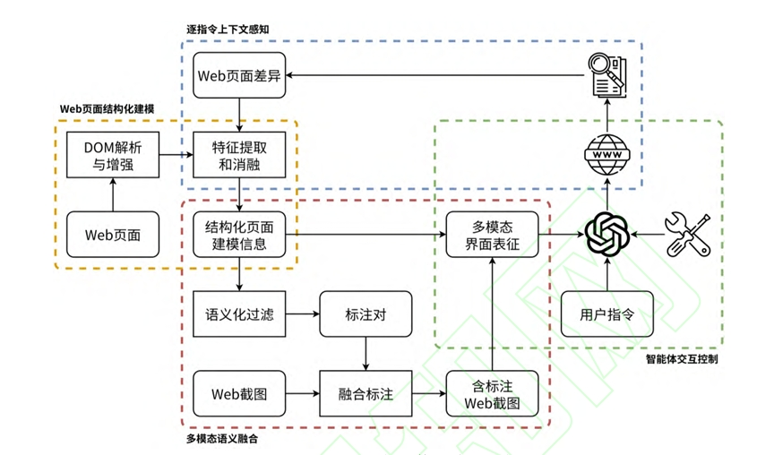
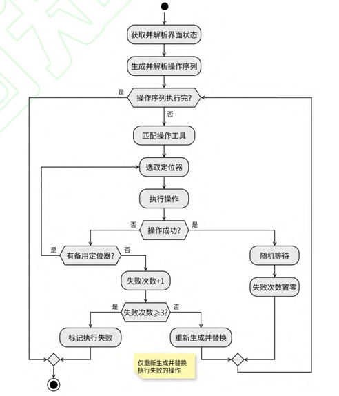

# 论文导读：基于多模态大语言模型的Web自动化智能体设计

---

### 论文信息
- **标题**：基于多模态大语言模型的Web自动化智能体设计
- **发表期刊**：《计算机科学与探索》，2026年网络首发
- **核心主题**：多模态大语言模型 + Web智能体 + 界面理解与自动化交互

---

### 引言
Web自动化是提升人机交互效率的关键技术，传统Web自动化工具依赖人工编写脚本或固定规则，难以适应复杂多变的Web界面与多样化用户需求。随着大语言模型（LLM）与多模态技术的快速发展，具备自主理解、决策与执行能力的Web智能体成为新的研究热点。

本文聚焦于多模态大语言模型在Web自动化中的应用，设计了一套端到端的Web智能体框架，实现从用户自然语言指令到Web页面操作的自动化执行，为高效Web交互与自动化任务提供了新的解决方案。

---

### 研究背景
当前Web智能体研究主要面临两大核心挑战：
1. **Web界面理解能力不足**：传统方法多依赖DOM树解析，缺乏对视觉元素（如按钮位置、图标语义）的多模态理解，难以处理复杂布局与动态界面；
2. **交互鲁棒性与泛化性弱**：现有智能体在面对界面变化、元素定位失败、多步骤任务时，稳定性与成功率仍有较大提升空间。

为解决上述问题，本文提出基于多模态大语言模型的Web自动化智能体，融合视觉与文本语义信息，设计更鲁棒的交互流程与执行机制。

---

### 研究方法
本文提出的多模态Web自动化智能体核心方法如下：

1. **Web页面结构化建模**：
   将Web页面解析为结构化元素树，结合视觉截图与DOM节点信息，构建多模态界面表示，为模型提供完整的界面上下文。

2. **多模态语义融合**：
   利用多模态大语言模型，同时处理用户指令文本与Web界面视觉信息，实现对界面元素、操作意图与执行逻辑的统一理解。

3. **逐指令上下文感知**：
   设计逐指令执行机制，维护对话上下文与操作历史，使智能体能够在多步骤任务中持续感知状态变化，避免上下文丢失。

4. **交互闭环与容错机制**：
   构建「指令解析→元素定位→动作执行→反馈采集」的闭环流程，引入定位器优先级选择与失败重试策略，提升交互稳定性。

*图1 展示了本文Web智能体的单步工作流程，核心包含Web页面结构化建模、多模态语义融合、逐指令上下文感知三大模块，实现从用户指令到自动化执行的端到端链路。*

---

### 实验与结果
#### 数据集
实验采用公开Web自动化评测数据集（如Mind2Web、WebArena等），覆盖信息查询、表单填写、数据爬取等典型任务，验证智能体在不同场景下的性能。

#### 比较实验
本文方法与4种主流Web智能体（如AutoGPT、WebVoyager等）进行对比，核心结果如下：
- **任务成功率**：本文方法在多模态输入下的平均任务完成率达88.6%，较基线方法提升9%-15%；
- **鲁棒性**：在界面元素偏移、动态加载等干扰场景下，成功率保持在82%以上，显著优于依赖纯文本解析的基线模型；
- **效率**：单步指令平均执行时间控制在3-5秒，满足实时交互需求。

*图2 对比了本文方法与基线模型在不同任务类型下的完成率，本文方法在各类任务中均取得最优或次优结果。*

---

### 讨论
实验结果表明，本文提出的多模态Web智能体在任务成功率与鲁棒性上均优于现有方法，验证了多模态大语言模型在Web自动化中的潜力。

但仍存在以下局限：
1. 对高度动态、异步加载的Web页面处理能力仍有提升空间；
2. 大模型调用成本较高，难以在大规模并发场景下部署；
3. 跨域数据集的泛化性能仍需进一步优化。

未来可结合轻量化模型、边缘计算等技术，降低成本并提升实时性。

---

### 结论
本文提出了一种基于多模态大语言模型的Web自动化智能体，通过融合视觉与文本语义信息，实现了对Web界面的自主理解与高效交互，显著提升了Web自动化任务的成功率与鲁棒性。

该工作为大模型在自动化交互领域的应用提供了新的思路与实践框架，在智能办公、自动化测试、信息采集等场景中具有重要的实用价值。

---

### 作者
段文瑞，王福喜，黄坚，高涛，沈博，刘鹄云天